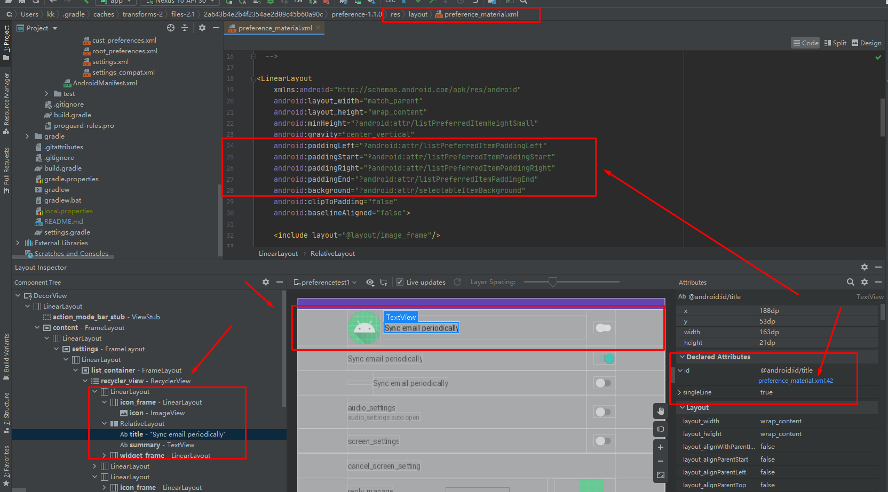

Androidx Preference 中的 间距通过分析 控件使用的布局来确认使用那些属性来修改。

利用Android Studio 的Layout Inspector 分析布局，看下控件使用的是哪个布局文件




preference_material.xml

```
<?xml version="1.0" encoding="utf-8"?>
<!--
  ~ Copyright (C) 2015 The Android Open Source Project
  ~
  ~ Licensed under the Apache License, Version 2.0 (the "License");
  ~ you may not use this file except in compliance with the License.
  ~ You may obtain a copy of the License at
  ~
  ~      http://www.apache.org/licenses/LICENSE-2.0
  ~
  ~ Unless required by applicable law or agreed to in writing, software
  ~ distributed under the License is distributed on an "AS IS" BASIS,
  ~ WITHOUT WARRANTIES OR CONDITIONS OF ANY KIND, either express or implied.
  ~ See the License for the specific language governing permissions and
  ~ limitations under the License.
  -->

<LinearLayout
    xmlns:android="http://schemas.android.com/apk/res/android"
    android:layout_width="match_parent"
    android:layout_height="wrap_content"
    android:minHeight="?android:attr/listPreferredItemHeightSmall"
    android:gravity="center_vertical"
    android:paddingLeft="?android:attr/listPreferredItemPaddingLeft"
    android:paddingStart="?android:attr/listPreferredItemPaddingStart"
    android:paddingRight="?android:attr/listPreferredItemPaddingRight"
    android:paddingEnd="?android:attr/listPreferredItemPaddingEnd"
    android:background="?android:attr/selectableItemBackground"
    android:clipToPadding="false"
    android:baselineAligned="false">

    <include layout="@layout/image_frame"/>

    <RelativeLayout
        android:layout_width="0dp"
        android:layout_height="wrap_content"
        android:layout_weight="1"
        android:paddingTop="16dp"
        android:paddingBottom="16dp">

        <TextView
            android:id="@android:id/title"
            android:layout_width="wrap_content"
            android:layout_height="wrap_content"
            android:singleLine="true"
            android:textAppearance="?android:attr/textAppearanceListItem"
            android:ellipsize="marquee"/>

        <TextView
            android:id="@android:id/summary"
            android:layout_width="wrap_content"
            android:layout_height="wrap_content"
            android:layout_below="@android:id/title"
            android:layout_alignLeft="@android:id/title"
            android:layout_alignStart="@android:id/title"
            android:layout_gravity="start"
            android:textAlignment="viewStart"
            android:textColor="?android:attr/textColorSecondary"
            android:maxLines="10"
            style="@style/PreferenceSummaryTextStyle"/>

    </RelativeLayout>

    <!-- Preference should place its actual preference widget here. -->
    <LinearLayout
        android:id="@android:id/widget_frame"
        android:layout_width="wrap_content"
        android:layout_height="match_parent"
        android:gravity="end|center_vertical"
        android:paddingLeft="16dp"
        android:paddingStart="16dp"
        android:paddingRight="0dp"
        android:paddingEnd="0dp"
        android:orientation="vertical"/>

</LinearLayout>
```


从上述布局文件可以看出 padding使用了，我们在自定义的style中替换掉系统的这个属性即可。

    android:paddingLeft="?android:attr/listPreferredItemPaddingLeft"
    android:paddingStart="?android:attr/listPreferredItemPaddingStart"
    android:paddingRight="?android:attr/listPreferredItemPaddingRight"
    android:paddingEnd="?android:attr/listPreferredItemPaddingEnd"


1.  

   ```xml
           <!--     如下的 list preferendItem   也可以使用来替换属性-->
           <item name="android:listPreferredItemPaddingLeft">@dimen/action_bar_content_inset_material</item>
           <item name="android:listPreferredItemPaddingRight">@dimen/action_bar_content_inset_material</item>
           <item name="android:listPreferredItemPaddingStart">@dimen/action_bar_content_inset_material</item>
           <item name="android:listPreferredItemPaddingEnd">@dimen/action_bar_content_inset_material</item>
   ```

   

2.  这种就是直接替换控件的布局文件，让布局文件加载我们的自定义的，但是需要注意 控件的id不能做替换

   


   如果要定制只能继承对应的修改对应的样式中的layout ，修改为我们想要的间距要求。

     <!--  设置Preference 主题，继承自 androidx包中的 PreferenceThemeOverlay -->
             <item name="preferenceTheme">@style/PreferenceThemeOverlay</item>

     定义样式，直接基于 androidx 中的样式拿过来，按照我们想要的样式做修改

```xml
      <style name="PreferenceThemeOverlay">

          <!-- switchPreferenceCompat 组件的 样式替换-->
          <item name="switchPreferenceCompatStyle">@style/Preference.SwitchPreferenceCompat.Material</item>
          <!-- switchPreference 组件的 样式替换-->
          <item name="switchPreferenceStyle">@style/Preference.SwitchPreference.Material</item>
          <!-- preference 组件的 样式替换-->
          <item name="preferenceStyle">@style/Preference.Material</item>

      </style>
```

```xml
    <style name="Preference.SwitchPreferenceCompat.Material">
<!--        使用自定义的layout，其中可以使用自定义的 间距-->
        <item name="android:layout">@layout/preference_material_cust</item>
        <item name="allowDividerAbove">false</item>
        <item name="allowDividerBelow">true</item>
        <item name="iconSpaceReserved">@bool/config_materialPreferenceIconSpaceReserved</item>
    </style>
```
```xml
    <style name="Preference.SwitchPreference.Material">
        <!--        使用自定义的layout，其中可以使用自定义的 间距-->
        <item name="android:layout">@layout/preference_material_cust</item>
        <item name="allowDividerAbove">false</item>
        <item name="allowDividerBelow">true</item>
        <item name="iconSpaceReserved">@bool/config_materialPreferenceIconSpaceReserved</item>
    </style>
```
```xml
    <style name="Preference.Material">
        <!--        使用自定义的layout，其中可以使用自定义的 间距-->
        <item name="android:layout">@layout/preference_material_cust</item>
        <item name="allowDividerAbove">false</item>
        <item name="allowDividerBelow">true</item>
        <item name="singleLineTitle">false</item>
        <item name="iconSpaceReserved">@bool/config_materialPreferenceIconSpaceReserved</item>
    </style>
```
